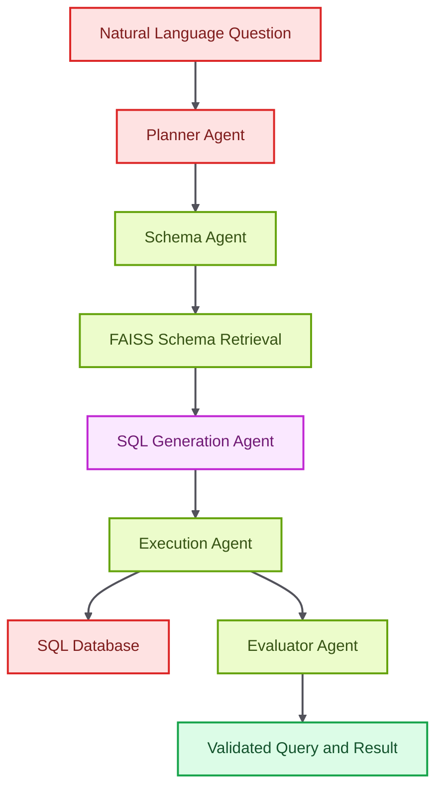

# Intelligent SQL Query Agent

<p align="center">

  
  
  
  
  
</p>

<p align="center">
  <strong>A multi-agent natural-language-to-SQL system with schema retrieval, execution checks, and evaluation pipelines.</strong>
</p>

The Intelligent SQL Query Agent translates natural language into database queries through a structured planning, schema retrieval, SQL generation, execution, and evaluation workflow. It is built for accuracy, traceability, and side-by-side comparison of single-agent, multi-agent, and retrieval-enhanced pipelines.

## Core Capabilities

- Retrieves relevant schema context using vector search.
- Separates planning, schema understanding, SQL generation, execution, and evaluation into distinct modules.
- Benchmarks multiple query-generation pipeline strategies.
- Includes Streamlit and analysis scripts for result inspection.

## Technical Architecture

The repository is organized around agent modules, RAG utilities, pipeline variants, evaluation scripts, and example entry points. FAISS-backed schema embeddings provide retrieval context while SQLAlchemy and sqlglot support database and SQL handling.

## Architecture Diagram



## Technology Stack

- LangChain and LangGraph for orchestration patterns.
- FAISS and sentence-transformers for schema retrieval.
- SQLAlchemy and sqlglot for database and query workflows.
- Streamlit and Plotly for interactive analysis.
- Rich, tqdm, and evaluation scripts for developer-facing diagnostics.

## Repository Structure

- `agents` - Planner, schema, SQL, executor, and evaluator modules.
- `rag` - Schema embeddings and retrieval methods.
- `pipelines` - Single-agent, multi-agent, and RAG-enhanced pipelines.
- `evaluation` - Evaluation workflows.
- `app.py` - Interactive application entry point.
- `full_evaluation.py` - Full benchmark runner.

## Getting Started

```bash
python -m venv .venv
source .venv/bin/activate
pip install -r requirements.txt
```

```bash
python main.py
streamlit run app.py
```

## Professional Context

This project demonstrates applied retrieval, structured reasoning, SQL execution safety, and evaluation-driven system design.
